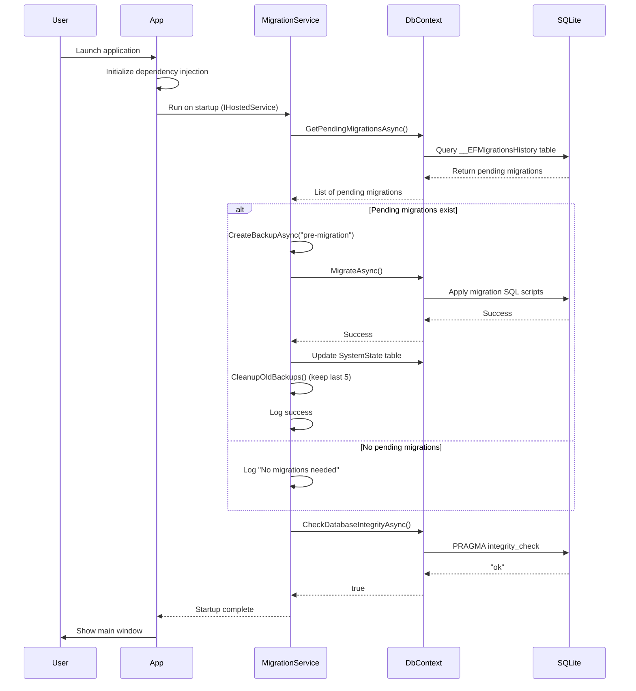

# Epic Technical Specification: Foundation and Data Layer

Date: 2026-01-30
Author: Sarunas Budreckis
Epic ID: epic-1
Status: Draft

---

## Overview

Epic 1 establishes the technical foundation for Google Calendar Management, a Windows desktop application transforming retroactive life tracking from a tedious chore into a fun, nostalgic ritual. This epic delivers the complete infrastructure enabling all subsequent development: .NET 9 + WinUI 3 project structure, SQLite database with Entity Framework Core, automatic schema versioning, and robust logging/error handling.

**Epic Value:** Without this foundation, no features can be implemented. Epic 1 creates the technical bedrock that all 3 phases depend upon—from Tier 1's read-only viewer through Tier 3's intelligent automation.

**Context from PRD:** The PRD defines a local-first Windows desktop application designed for decades of personal use, requiring bulletproof data integrity, seamless migrations, and extensible architecture. Epic 1 translates these requirements into working infrastructure that enables the product vision.

## Objectives and Scope

### In Scope

**Story 1.1: Project Structure**
- Create .NET 9 WinUI 3 desktop application with proper folder organization
- Configure dependency injection, editorconfig, gitignore
- Establish testing framework (xUnit, FluentAssertions, Moq) from first story
- Deliver launchable application with basic window

**Story 1.2: Database Configuration**
- Entity Framework Core 9 with SQLite provider
- DbContext with dependency injection
- Database file in user AppData folder with WAL mode for crash recovery
- Migrations system enabled

**Story 1.3: Core Database Schema (Tier 1 Tables)**
- **7 Tier 1 tables:** gcal_event, gcal_event_version, save_state, audit_log, config, data_source_refresh, system_state
- Complete indexes and foreign key constraints
- Version history tracking for rollback capability
- Repository pattern for data access

**Story 1.4: Automatic Versioning**
- Automatic schema migration on app startup
- Database backup before migrations with cleanup (keep last 5)
- Integrity checks on startup
- Migration success/failure logging

**Story 1.5: Development Environment**
- README with setup instructions, prerequisites, troubleshooting
- Debug and Release build configurations
- Self-contained publish capability
- Version management in project file

**Story 1.6: Logging & Error Handling**
- Serilog with file output (daily rotation, 30-day retention)
- Global exception handler with state preservation
- Structured logging with performance tracking (operations >1s)
- Separate log files for app, database, API concerns

### Out of Scope

- **UI implementation** (Epic 3)
- **Google Calendar API integration** (Epic 2)
- **Tier 2/3 database tables** (toggl_data, youtube_data, call_log_data, etc.) - added in later epics
- **Data source integrations** (Epic 4)
- **User documentation** - developer-focused only in Epic 1

### Dependencies

- **Prerequisite:** None - this is the first epic
- **Enables:** All subsequent epics (2-10)
- **External dependencies:** .NET 9 SDK, Visual Studio 2022, Windows App SDK 1.8.3

## System Architecture Alignment

Epic 1 implements the complete architectural foundation defined in [architecture.md](./architecture.md):

**Project Structure Alignment:**
- Implements the 3-layer separation: UI (WinUI 3) → Core (business logic) → Data (EF Core)
- Creates `GoogleCalendarManagement/`, `GoogleCalendarManagement.Core/`, `GoogleCalendarManagement.Data/`, `GoogleCalendarManagement.Tests/` projects
- Establishes folder conventions: Views/, ViewModels/, Services/, Repositories/, Entities/, Configurations/

**Technology Stack Alignment:**
- .NET 9.0.12 runtime (latest patch, January 2026)
- Windows App SDK 1.8.3 for WinUI 3
- Entity Framework Core 9.0.12 with SQLite provider
- Serilog 4.x for structured logging
- Testing: xUnit 2.x, Moq 4.x, FluentAssertions 6.x

**Database Architecture Alignment:**
- Implements Tier 1 schema: 7 core tables as defined in [_database-schemas.md](../_database-schemas.md)
- Singular table naming (gcal_event not gcal_events) per [_key-decisions.md](../_key-decisions.md) §3
- Repository pattern with EF Core as specified in architecture
- SQLite with WAL mode for crash recovery (NFR-D1)

**Naming Patterns Alignment:**
- C# classes: PascalCase (GoogleCalendarService, DateStateRepository)
- Interfaces: IPascalCase (IDataSourceService)
- Database tables: snake_case singular (gcal_event, date_state)
- Boolean columns: descriptive with context (published_to_gcal, visible_as_event)
- Timestamps: suffix with _at (created_at, updated_at)

**Key Architectural Decisions Implemented:**
- **Decision §1:** .NET 9 + WinUI 3 for native Windows performance and future-proof framework
- **Decision §2:** SQLite + EF Core for local-first, single-file, portable database
- **Decision §3:** Singular table naming following .NET best practices
- **Decision §17:** Graceful error handling with Serilog structured logging and retry policies

**Extensibility Foundation:**
- Separation of concerns enables future web/mobile UIs (data layer is UI-agnostic)
- Repository pattern supports testing and future data source swapping
- Configuration-driven settings in config table
- Migration system supports evolution across phases

## Detailed Design

### Services and Modules

Epic 1 establishes the core service infrastructure and module organization:

| Module/Service | Responsibility | Inputs | Outputs | Owner Story |
|---------------|----------------|---------|---------|-------------|
| **CalendarDbContext** | EF Core database context, manages all entity sets | Connection string, entities | Database operations, SaveChangesAsync | Story 1.2 |
| **Repository<T>** | Generic repository pattern for data access | Entity queries | CRUD operations, async methods | Story 1.3 |
| **MigrationService** | Automatic schema versioning on startup | Pending migrations | Applied migrations, backups | Story 1.4 |
| **LoggingService** | Serilog configuration and structured logging | Log events | Timestamped logs (app, db, api) | Story 1.6 |
| **ErrorHandlingService** | Global exception handling, state preservation | Unhandled exceptions | Logged errors, graceful exit | Story 1.6 |

**Service Layer Organization (Story 1.1):**
```
GoogleCalendarManagement.Core/
├── Services/
│   └── (Future: GoogleCalendarService, TogglService, etc.)
├── Managers/
│   └── (Future: ApprovalManager, PublishManager, SyncManager)
└── Interfaces/
    ├── IRepository.cs
    └── (Future: IDataSourceService, IGoogleCalendarService)

GoogleCalendarManagement.Data/
├── CalendarDbContext.cs
├── Repositories/
│   ├── IRepository.cs
│   ├── Repository.cs
│   └── (Future: DateStateRepository, GcalEventRepository)
└── Migrations/
    └── (Generated migration files)
```

**Dependency Injection Setup (Story 1.1):**
```csharp
// App.xaml.cs
services.AddDbContext<CalendarDbContext>(options =>
    options.UseSqlite($"Data Source={dbPath}"));
services.AddScoped(typeof(IRepository<>), typeof(Repository<>));
services.AddSingleton<ILogger>(Log.Logger);
services.AddHostedService<MigrationService>(); // Runs on startup
```

### Data Models and Contracts

**Tier 1 Database Schema (Story 1.3):**

Epic 1 implements 7 core tables as defined in [_database-schemas.md](../_database-schemas.md):

#### 1. gcal_event
Core table for Google Calendar events cache.

```csharp
public class GcalEvent
{
    [Key]
    [Column("gcal_event_id")]
    public string GcalEventId { get; set; }  // Google's event ID

    [Column("calendar_id")]
    [Required]
    public string CalendarId { get; set; }

    [Column("summary")]
    public string Summary { get; set; }

    [Column("description")]
    public string Description { get; set; }

    [Column("start_datetime")]
    public DateTime StartDateTime { get; set; }

    [Column("end_datetime")]
    public DateTime EndDateTime { get; set; }

    [Column("is_all_day")]
    public bool IsAllDay { get; set; }

    [Column("color_id")]
    public string ColorId { get; set; }

    // Version tracking
    [Column("gcal_etag")]
    public string GcalEtag { get; set; }

    [Column("gcal_updated_at")]
    public DateTime? GcalUpdatedAt { get; set; }

    [Column("is_deleted")]
    public bool IsDeleted { get; set; } = false;

    // Ownership tracking
    [Column("app_created")]
    public bool AppCreated { get; set; } = false;

    // Source tracking (Tier 3)
    [Column("source_system")]
    public string SourceSystem { get; set; }

    [Column("app_published")]
    public bool AppPublished { get; set; } = false;

    [Column("app_published_at")]
    public DateTime? AppPublishedAt { get; set; }

    [Column("app_last_modified_at")]
    public DateTime? AppLastModifiedAt { get; set; }

    // Recurring events
    [Column("recurring_event_id")]
    public string RecurringEventId { get; set; }

    [Column("is_recurring_instance")]
    public bool IsRecurringInstance { get; set; } = false;

    // Timestamps
    [Column("last_synced_at")]
    public DateTime? LastSyncedAt { get; set; }

    [Column("created_at")]
    public DateTime CreatedAt { get; set; } = DateTime.UtcNow;

    [Column("updated_at")]
    public DateTime UpdatedAt { get; set; } = DateTime.UtcNow;

    // Navigation properties
    public virtual ICollection<GcalEventVersion> Versions { get; set; }
}
```

**Indexes (configured in GcalEventConfiguration.cs):**
```csharp
builder.HasIndex(e => new { e.StartDateTime, e.EndDateTime })
    .HasDatabaseName("idx_gcal_event_date");
builder.HasIndex(e => e.RecurringEventId)
    .HasDatabaseName("idx_gcal_recurring");
builder.HasIndex(e => e.SourceSystem)
    .HasDatabaseName("idx_gcal_source");
builder.HasIndex(e => e.AppCreated)
    .HasDatabaseName("idx_gcal_app_created");
```

#### 2. gcal_event_version
Full version history for rollback.

```csharp
public class GcalEventVersion
{
    [Key]
    [Column("version_id")]
    public int VersionId { get; set; }

    [Column("gcal_event_id")]
    [Required]
    public string GcalEventId { get; set; }

    [Column("gcal_etag")]
    public string GcalEtag { get; set; }

    // Event snapshot
    [Column("summary")]
    public string Summary { get; set; }

    [Column("description")]
    public string Description { get; set; }

    [Column("start_datetime")]
    public DateTime StartDateTime { get; set; }

    [Column("end_datetime")]
    public DateTime EndDateTime { get; set; }

    [Column("is_all_day")]
    public bool IsAllDay { get; set; }

    [Column("color_id")]
    public string ColorId { get; set; }

    // Change tracking
    [Column("changed_by")]
    public string ChangedBy { get; set; }  // 'user_approval', 'gcal_sync', 'rollback', 'manual_edit'

    [Column("change_reason")]
    public string ChangeReason { get; set; }

    [Column("created_at")]
    public DateTime CreatedAt { get; set; } = DateTime.UtcNow;

    // Navigation
    [ForeignKey("GcalEventId")]
    public virtual GcalEvent GcalEvent { get; set; }
}
```

#### 3. save_state
Snapshots for rollback functionality.

```csharp
public class SaveState
{
    [Key]
    [Column("save_id")]
    public int SaveId { get; set; }

    [Column("save_name")]
    [Required]
    public string SaveName { get; set; }

    [Column("save_description")]
    public string SaveDescription { get; set; }

    [Column("created_at")]
    public DateTime CreatedAt { get; set; } = DateTime.UtcNow;

    [Column("snapshot_data")]
    public string SnapshotData { get; set; }  // JSON: {event_id: {summary, description, ...}}
}
```

#### 4. audit_log
Complete operation audit trail.

```csharp
public class AuditLog
{
    [Key]
    [Column("log_id")]
    public int LogId { get; set; }

    [Column("timestamp")]
    public DateTime Timestamp { get; set; } = DateTime.UtcNow;

    [Column("operation_type")]
    [Required]
    public string OperationType { get; set; }  // 'sync', 'publish', 'approve', 'undo', 'save', 'import', 'rollback'

    [Column("operation_details")]
    public string OperationDetails { get; set; }  // JSON

    [Column("affected_dates")]
    public string AffectedDates { get; set; }

    [Column("affected_events")]
    public string AffectedEvents { get; set; }  // JSON array

    [Column("user_action")]
    public bool UserAction { get; set; }

    [Column("success")]
    public bool Success { get; set; }

    [Column("error_message")]
    public string ErrorMessage { get; set; }
}
```

#### 5. config
Application configuration storage.

```csharp
public class Config
{
    [Key]
    [Column("config_key")]
    public string ConfigKey { get; set; }

    [Column("config_value")]
    public string ConfigValue { get; set; }

    [Column("config_type")]
    public string ConfigType { get; set; }  // 'string', 'integer', 'boolean', 'json'

    [Column("description")]
    public string Description { get; set; }

    [Column("updated_at")]
    public DateTime UpdatedAt { get; set; } = DateTime.UtcNow;
}
```

**Seed Data (Story 1.3):**
```csharp
// Initial configuration values
new Config { ConfigKey = "min_event_duration_minutes", ConfigValue = "5", ConfigType = "integer", Description = "Minimum duration to show events" },
new Config { ConfigKey = "phone_coalesce_gap_minutes", ConfigValue = "15", ConfigType = "integer", Description = "Max gap for phone coalescing" },
new Config { ConfigKey = "youtube_coalesce_gap_minutes", ConfigValue = "30", ConfigType = "integer", Description = "Gap after video duration for YouTube" },
new Config { ConfigKey = "call_min_duration_minutes", ConfigValue = "3", ConfigType = "integer", Description = "Minimum call duration to import" },
new Config { ConfigKey = "eight_fifteen_threshold", ConfigValue = "8", ConfigType = "integer", Description = "Minutes required in 15-min block" }
```

#### 6. data_source_refresh
Tracks API cache refresh and provides sync status.

```csharp
public class DataSourceRefresh
{
    [Key]
    [Column("refresh_id")]
    public int RefreshId { get; set; }

    [Column("source_name")]
    [Required]
    public string SourceName { get; set; }  // 'gcal', 'toggl', 'youtube', 'call_log'

    [Column("start_date")]
    public DateTime? StartDate { get; set; }

    [Column("end_date")]
    public DateTime? EndDate { get; set; }

    [Column("last_refreshed_at")]
    public DateTime? LastRefreshedAt { get; set; }

    [Column("records_fetched")]
    public int? RecordsFetched { get; set; }

    [Column("success")]
    public bool Success { get; set; }

    [Column("error_message")]
    public string ErrorMessage { get; set; }
}
```

#### 7. system_state
Application-level state storage.

```csharp
public class SystemState
{
    [Key]
    [Column("state_id")]
    public int StateId { get; set; }

    [Column("state_name")]
    [Required]
    public string StateName { get; set; }

    [Column("state_value")]
    public string StateValue { get; set; }

    [Column("updated_at")]
    public DateTime UpdatedAt { get; set; } = DateTime.UtcNow;
}
```

**Key Design Notes:**
- All DateTime fields stored as UTC
- Boolean columns have descriptive names (app_created, is_deleted, not just "created", "deleted")
- Timestamps suffixed with _at (created_at, updated_at)
- Foreign keys reference full field name (gcal_event_id)
- JSON fields use System.Text.Json for serialization
- Navigation properties configured via Fluent API in Configuration classes

### APIs and Interfaces

Epic 1 establishes core interfaces for the repository pattern and future extensibility:

#### IRepository<T>
Generic repository interface for data access abstraction.

```csharp
namespace GoogleCalendarManagement.Data.Repositories;

public interface IRepository<T> where T : class
{
    // Read operations
    Task<T> GetByIdAsync(object id);
    Task<IEnumerable<T>> GetAllAsync();
    Task<IEnumerable<T>> FindAsync(Expression<Func<T, bool>> predicate);
    Task<T> SingleOrDefaultAsync(Expression<Func<T, bool>> predicate);

    // Write operations
    Task AddAsync(T entity);
    Task AddRangeAsync(IEnumerable<T> entities);
    void Update(T entity);
    void UpdateRange(IEnumerable<T> entities);
    void Remove(T entity);
    void RemoveRange(IEnumerable<T> entities);

    // Persistence
    Task<int> SaveChangesAsync();

    // Query helpers
    IQueryable<T> Query();
    IQueryable<T> QueryNoTracking();
}
```

**Implementation (Story 1.3):**
```csharp
namespace GoogleCalendarManagement.Data.Repositories;

public class Repository<T> : IRepository<T> where T : class
{
    private readonly CalendarDbContext _context;
    private readonly DbSet<T> _dbSet;

    public Repository(CalendarDbContext context)
    {
        _context = context;
        _dbSet = context.Set<T>();
    }

    public async Task<T> GetByIdAsync(object id)
        => await _dbSet.FindAsync(id);

    public async Task<IEnumerable<T>> GetAllAsync()
        => await _dbSet.ToListAsync();

    public async Task<IEnumerable<T>> FindAsync(Expression<Func<T, bool>> predicate)
        => await _dbSet.Where(predicate).ToListAsync();

    public async Task<T> SingleOrDefaultAsync(Expression<Func<T, bool>> predicate)
        => await _dbSet.SingleOrDefaultAsync(predicate);

    public async Task AddAsync(T entity)
        => await _dbSet.AddAsync(entity);

    public async Task AddRangeAsync(IEnumerable<T> entities)
        => await _dbSet.AddRangeAsync(entities);

    public void Update(T entity)
        => _dbSet.Update(entity);

    public void UpdateRange(IEnumerable<T> entities)
        => _dbSet.UpdateRange(entities);

    public void Remove(T entity)
        => _dbSet.Remove(entity);

    public void RemoveRange(IEnumerable<T> entities)
        => _dbSet.RemoveRange(entities);

    public async Task<int> SaveChangesAsync()
        => await _context.SaveChangesAsync();

    public IQueryable<T> Query()
        => _dbSet.AsQueryable();

    public IQueryable<T> QueryNoTracking()
        => _dbSet.AsNoTracking();
}
```

#### CalendarDbContext
EF Core database context managing all entity sets.

```csharp
namespace GoogleCalendarManagement.Data;

public class CalendarDbContext : DbContext
{
    public CalendarDbContext(DbContextOptions<CalendarDbContext> options)
        : base(options)
    {
    }

    // Tier 1 DbSets
    public DbSet<GcalEvent> GcalEvents { get; set; }
    public DbSet<GcalEventVersion> GcalEventVersions { get; set; }
    public DbSet<SaveState> SaveStates { get; set; }
    public DbSet<AuditLog> AuditLogs { get; set; }
    public DbSet<Config> Configs { get; set; }
    public DbSet<DataSourceRefresh> DataSourceRefreshes { get; set; }
    public DbSet<SystemState> SystemStates { get; set; }

    protected override void OnConfiguring(DbContextOptionsBuilder optionsBuilder)
    {
        if (!optionsBuilder.IsConfigured)
        {
            // Fallback configuration if not set in DI
            var dbPath = Path.Combine(
                Environment.GetFolderPath(Environment.SpecialFolder.LocalApplicationData),
                "GoogleCalendarManagement",
                "calendar.db");

            optionsBuilder.UseSqlite($"Data Source={dbPath}");
        }

        // Enable WAL mode for crash recovery (NFR-D1)
        optionsBuilder.UseSqlite(sqliteOptions =>
        {
            sqliteOptions.CommandTimeout(60);
        });
    }

    protected override void OnModelCreating(ModelBuilder modelBuilder)
    {
        base.OnModelCreating(modelBuilder);

        // Apply entity configurations
        modelBuilder.ApplyConfiguration(new GcalEventConfiguration());
        modelBuilder.ApplyConfiguration(new GcalEventVersionConfiguration());
        modelBuilder.ApplyConfiguration(new SaveStateConfiguration());
        modelBuilder.ApplyConfiguration(new AuditLogConfiguration());
        modelBuilder.ApplyConfiguration(new ConfigConfiguration());
        modelBuilder.ApplyConfiguration(new DataSourceRefreshConfiguration());
        modelBuilder.ApplyConfiguration(new SystemStateConfiguration());

        // Seed initial configuration data
        SeedConfigurationData(modelBuilder);
    }

    private void SeedConfigurationData(ModelBuilder modelBuilder)
    {
        modelBuilder.Entity<Config>().HasData(
            new Config { ConfigKey = "min_event_duration_minutes", ConfigValue = "5", ConfigType = "integer", Description = "Minimum duration to show events" },
            new Config { ConfigKey = "phone_coalesce_gap_minutes", ConfigValue = "15", ConfigType = "integer", Description = "Max gap for phone coalescing" },
            new Config { ConfigKey = "youtube_coalesce_gap_minutes", ConfigValue = "30", ConfigType = "integer", Description = "Gap after video duration for YouTube" },
            new Config { ConfigKey = "call_min_duration_minutes", ConfigValue = "3", ConfigType = "integer", Description = "Minimum call duration to import" },
            new Config { ConfigKey = "eight_fifteen_threshold", ConfigValue = "8", ConfigType = "integer", Description = "Minutes required in 15-min block" }
        );
    }
}
```

#### MigrationService
Automatic schema versioning on application startup (Story 1.4).

```csharp
namespace GoogleCalendarManagement.Core.Services;

public interface IMigrationService
{
    Task ApplyMigrationsAsync();
    Task<bool> CheckDatabaseIntegrityAsync();
    Task CreateBackupAsync(string backupReason);
}

public class MigrationService : IMigrationService
{
    private readonly CalendarDbContext _context;
    private readonly ILogger<MigrationService> _logger;

    public MigrationService(CalendarDbContext context, ILogger<MigrationService> logger)
    {
        _context = context;
        _logger = logger;
    }

    public async Task ApplyMigrationsAsync()
    {
        try
        {
            var pendingMigrations = await _context.Database.GetPendingMigrationsAsync();

            if (pendingMigrations.Any())
            {
                _logger.LogInformation("Found {Count} pending migrations", pendingMigrations.Count());

                // Create backup before migration
                await CreateBackupAsync("pre-migration");

                // Apply migrations
                await _context.Database.MigrateAsync();

                _logger.LogInformation("Successfully applied {Count} migrations", pendingMigrations.Count());

                // Update database schema version in system_state
                var version = (await _context.Database.GetAppliedMigrationsAsync()).Last();
                var state = await _context.SystemStates.SingleOrDefaultAsync(s => s.StateName == "DatabaseSchemaVersion");
                if (state == null)
                {
                    await _context.SystemStates.AddAsync(new SystemState
                    {
                        StateName = "DatabaseSchemaVersion",
                        StateValue = version
                    });
                }
                else
                {
                    state.StateValue = version;
                    state.UpdatedAt = DateTime.UtcNow;
                }
                await _context.SaveChangesAsync();
            }
        }
        catch (Exception ex)
        {
            _logger.LogError(ex, "Migration failed");
            throw;
        }
    }

    public async Task<bool> CheckDatabaseIntegrityAsync()
    {
        try
        {
            // SQLite PRAGMA integrity_check
            using var command = _context.Database.GetDbConnection().CreateCommand();
            command.CommandText = "PRAGMA integrity_check;";
            await _context.Database.OpenConnectionAsync();
            var result = await command.ExecuteScalarAsync();
            return result?.ToString() == "ok";
        }
        catch (Exception ex)
        {
            _logger.LogError(ex, "Database integrity check failed");
            return false;
        }
    }

    public async Task CreateBackupAsync(string backupReason)
    {
        var dbPath = Path.Combine(
            Environment.GetFolderPath(Environment.SpecialFolder.LocalApplicationData),
            "GoogleCalendarManagement",
            "calendar.db");

        var backupPath = Path.Combine(
            Environment.GetFolderPath(Environment.SpecialFolder.LocalApplicationData),
            "GoogleCalendarManagement",
            $"calendar_backup_{DateTime.UtcNow:yyyyMMdd_HHmmss}_{backupReason}.db");

        File.Copy(dbPath, backupPath);
        _logger.LogInformation("Created backup: {BackupPath}", backupPath);

        // Cleanup old backups (keep last 5)
        var backupDir = Path.GetDirectoryName(backupPath);
        var backups = Directory.GetFiles(backupDir, "calendar_backup_*.db")
            .OrderByDescending(f => File.GetCreationTimeUtc(f))
            .Skip(5);

        foreach (var oldBackup in backups)
        {
            File.Delete(oldBackup);
            _logger.LogInformation("Deleted old backup: {BackupPath}", oldBackup);
        }
    }
}
```

**API Notes:**
- No external APIs in Epic 1 (Google Calendar API added in Epic 2)
- Repository pattern abstracts data access for testability
- MigrationService runs on app startup as IHostedService
- All database operations use async/await patterns
- Logging integrated throughout for observability

### Workflows and Sequencing

**Epic 1 Story Execution Sequence:**

```
Story 1.1 (Project Structure)
    ↓
Story 1.2 (Database Configuration) ← depends on 1.1
    ↓
Story 1.3 (Database Schema) ← depends on 1.2
    ↓
Story 1.4 (Automatic Versioning) ← depends on 1.3
    ↓
Story 1.5 (Development Environment) ← depends on 1.1-1.4
    ↓
Story 1.6 (Logging & Error Handling) ← can run parallel to 1.5, depends on 1.1
```

#### Application Startup Sequence (Story 1.4)



#### Database Migration Workflow (Story 1.4)

**Step 1: Developer creates migration**
```bash
# From GoogleCalendarManagement.Data project directory
dotnet ef migrations add InitialCreate
```

**Step 2: Migration file generated**
```csharp
// Migrations/20260130_InitialCreate.cs
public partial class InitialCreate : Migration
{
    protected override void Up(MigrationBuilder migrationBuilder)
    {
        migrationBuilder.CreateTable(
            name: "gcal_event",
            columns: table => new
            {
                gcal_event_id = table.Column<string>(...),
                // ... all columns
            });
        // ... all 7 tables
    }

    protected override void Down(MigrationBuilder migrationBuilder)
    {
        migrationBuilder.DropTable("gcal_event");
        // ... all tables
    }
}
```

**Step 3: Automatic application on startup**
- MigrationService detects pending migration
- Creates backup: `calendar_backup_20260130_143022_pre-migration.db`
- Applies migration to SQLite database
- Updates `system_state` table with schema version
- Logs success/failure

#### Error Handling Flow (Story 1.6)

```
Application Error Occurs
    ↓
Global Exception Handler Catches
    ↓
Log to Serilog (structured data)
    ├─ Error details to app-{date}.txt
    ├─ Stack trace with context
    └─ User-friendly message prepared
    ↓
Check if Critical Error
    ├─ YES → Save application state
    │         ├─ Flush logs
    │         ├─ Close DB connections
    │         └─ Show error dialog with recovery options
    │
    └─ NO → Log error, show toast notification
            └─ Continue application execution
```

**Logging Output Structure (Story 1.6):**

```
%LOCALAPPDATA%/GoogleCalendarManagement/logs/
├── app-20260130.txt           # Application logs
├── app-20260129.txt           # Previous day (retained 30 days)
└── app-20260128.txt
```

**Log Entry Format:**
```
2026-01-30 14:30:22 [INF] Application starting (GoogleCalendarManagement v1.0.0)
2026-01-30 14:30:23 [INF] Database connection established: calendar.db
2026-01-30 14:30:23 [INF] MigrationService: No pending migrations
2026-01-30 14:30:23 [INF] Database integrity check: OK
2026-01-30 14:30:24 [INF] Main window displayed
2026-01-30 14:35:12 [WRN] Slow operation detected: SaveChangesAsync took 1523ms
2026-01-30 14:40:05 [ERR] Failed to save event: SQLite constraint violation
    Exception: Microsoft.EntityFrameworkCore.DbUpdateException
    Message: An error occurred while saving the entity changes. See the inner exception for details.
    StackTrace: ...
```

## Non-Functional Requirements

### Performance

**NFR-P1: Database Operations** (from PRD NFR-P2)
- Database initialization: <500ms (Story 1.2)
- Database queries: <100ms for typical operations (Story 1.3)
- Migration application: <5 seconds for initial schema creation (Story 1.4)
- Repository operations: Async/await throughout for non-blocking I/O

**Implementation:**
- SQLite with WAL mode for concurrent read performance
- Indexed columns for all date range queries
- `AsNoTracking()` for read-only repository queries
- Connection pooling enabled by default in EF Core

**NFR-P2: Application Launch** (from PRD NFR-P3)
- Cold start: <2 seconds to usable UI (Story 1.1)
- Database initialization non-blocking (Story 1.2)
- Migration service runs as background IHostedService (Story 1.4)

**Performance Monitoring** (Story 1.6)
- Serilog tracks operations >1 second with warning level
- Database query times logged for analysis
- Slow operation detection helps identify bottlenecks

### Security

**NFR-S2: Data Privacy** (from PRD, applies to Epic 1)
- All personal data stored locally in user's AppData folder (Story 1.2)
- Database file permissions restricted to user account (Windows ACL default)
- No telemetry, analytics, or usage tracking (Story 1.6 - logging is local only)
- Backup files stored locally with same permissions (Story 1.4)

**NFR-S4: Local Database** (from PRD)
- SQLite database file encrypted: OPTIONAL in Tier 1 (user preference for future)
- No plain-text passwords stored (Tier 1 has no auth - Epic 2 handles OAuth)
- Audit log captures all data modifications (Story 1.3, 1.6)
- Automatic backups before destructive operations (Story 1.4)

**File System Security** (Story 1.2)
```csharp
// Database location with user-only access
var dbPath = Path.Combine(
    Environment.GetFolderPath(Environment.SpecialFolder.LocalApplicationData),
    "GoogleCalendarManagement",
    "calendar.db");

// Create directory with secure permissions
var dirInfo = Directory.CreateDirectory(Path.GetDirectoryName(dbPath));
// Windows default: User has full control, no other users have access
```

**Security Considerations for Future Epics:**
- Epic 2 will add Windows DPAPI for OAuth token encryption (NFR-S1)
- Epic 4 will add API key storage with DPAPI encryption
- Database encryption can be added in Tier 2+ if user requests

### Reliability/Availability

**NFR-D1: Data Loss Prevention** (from PRD)
- SQLite WAL mode for crash recovery (Story 1.2)
  ```csharp
  // Configured in connection string
  "Data Source=calendar.db;Mode=ReadWrite;Journal Mode=WAL"
  ```
- Auto-save before all destructive operations (Story 1.4 - migration backups)
- Complete version history for Google Calendar events (Story 1.3 - gcal_event_version table)
- Never delete source data - mark inactive instead (implemented in Tier 3 tables)

**NFR-D3: Database Integrity** (from PRD, Story 1.3, 1.4)
- Foreign key constraints enforced in all entity configurations
- Database integrity check on app launch (Story 1.4)
  ```csharp
  PRAGMA integrity_check; // Returns "ok" if database is valid
  ```
- Schema migration tests before deployment (Story 1.5 - test project)
- Automatic backup before migrations (Story 1.4)

**NFR-D4: Audit Trail** (from PRD, Story 1.3)
- All operations logged with timestamp and user action flag (audit_log table)
- Rollback capability for all published events (save_state table)
- Migration history tracked by EF Core (__EFMigrationsHistory table)
- Undo/redo for last 10 operations (future Epic 6, foundation in audit_log)

**Error Recovery** (Story 1.6)
- Critical errors save app state before exit
- Database connections properly disposed
- Transaction rollback on save failures
- Clear error messages with recovery options

**Backup Strategy** (Story 1.4)
- Automatic backup before each migration
- Timestamp-based naming: `calendar_backup_20260130_143022_pre-migration.db`
- Keep last 5 backups, auto-delete older
- Manual backup: User can copy `calendar.db` file anytime

### Observability

**Logging Requirements** (Story 1.6, from PRD NFR-I3 and NFR-U4)

**Log Levels:**
- **Debug:** Detailed flow, variable values, internal state (disabled in Release)
- **Information:** Normal operations, startup, migrations, database operations
- **Warning:** Slow operations (>1s), approaching limits, deprecated usage
- **Error:** Failed operations, exceptions caught and handled
- **Critical:** Unhandled exceptions, data corruption detected, startup failures

**Structured Logging with Serilog:**
```csharp
// Configuration in App.xaml.cs
Log.Logger = new LoggerConfiguration()
    .MinimumLevel.Information()
    .MinimumLevel.Override("Microsoft", LogEventLevel.Warning)
    .Enrich.FromLogContext()
    .Enrich.WithProperty("Application", "GoogleCalendarManagement")
    .Enrich.WithProperty("Version", Assembly.GetExecutingAssembly().GetName().Version.ToString())
    .WriteTo.Console()
    .WriteTo.File(
        path: Path.Combine(logFolder, "app-.txt"),
        rollingInterval: RollingInterval.Day,
        retainedFileCountLimit: 30,
        outputTemplate: "{Timestamp:yyyy-MM-dd HH:mm:ss} [{Level:u3}] {Message:lj}{NewLine}{Exception}")
    .CreateLogger();
```

**Required Log Signals:**

**Story 1.1 - Application Lifecycle:**
- Application start/stop with version info
- Dependency injection configuration complete
- Main window displayed

**Story 1.2 - Database Operations:**
- Database connection established/closed
- Connection string (sanitized - no sensitive data)
- Database file path and size

**Story 1.3 - Data Access:**
- Entity CRUD operations (Info level)
- Query execution times >100ms (Warning)
- Foreign key constraint violations (Error)
- Transaction commit/rollback

**Story 1.4 - Migrations:**
- Pending migrations detected (count)
- Backup created (file path, size)
- Migration applied successfully
- Database schema version updated
- Integrity check result
- Migration errors with full exception details

**Story 1.6 - Error Handling:**
- All exceptions with stack trace
- User action context (what were they doing?)
- Application state snapshot for critical errors
- Recovery actions attempted

**Performance Tracking:**
```csharp
using (_logger.BeginTimedOperation("Database migration"))
{
    await _context.Database.MigrateAsync();
}
// Logs: "Database migration completed in 1523ms"
```

**Log File Organization:**
```
%LOCALAPPDATA%/GoogleCalendarManagement/logs/
├── app-20260130.txt          # Today's application logs
├── app-20260129.txt          # Yesterday (auto-retained 30 days)
└── migrations.log            # Dedicated migration history (Story 1.4)
```

**Log Rotation:**
- Daily rotation (RollingInterval.Day)
- Retain last 30 days automatically
- Older logs auto-deleted
- File size limit: None (expect <10MB/day for normal usage)

**Metrics Tracked:**
- Slow operations: Any operation >1 second
- Database query times
- Startup time (application launch to main window)
- Migration execution time

**Future Observability (Post-Epic 1):**
- API call durations and error rates (Epic 2+)
- User interaction telemetry (opt-in, future)
- Performance counters (memory, CPU usage)
- Crash reporting (local only, no external service)

## Dependencies and Integrations

### External Dependencies

**Development Tools (Story 1.5):**
- **Visual Studio 2022 (Community or higher)** - Version 17.9+ with:
  - .NET desktop development workload
  - Windows App SDK components
  - NuGet package manager
- **.NET 9 SDK** - Version 9.0.12 (January 2026 patch)
  - Download: https://dotnet.microsoft.com/download/dotnet/9.0
- **Windows App SDK** - Version 1.8.3
  - Bundled with VS 2022, separate install for CLI

**Runtime Requirements:**
- **Windows 10** version 1809 (October 2018 Update) or later
- **Windows 11** (recommended for best Fluent Design experience)
- **.NET 9 Runtime** (included in self-contained publish)

### NuGet Package Dependencies

**Story 1.1 - Project Structure:**
```xml
<!-- WinUI 3 Framework -->
<PackageReference Include="Microsoft.WindowsAppSDK" Version="1.8.3" />
<PackageReference Include="Microsoft.Windows.SDK.BuildTools" Version="10.0.26100.1742" />

<!-- MVVM Toolkit (for future ViewModels) -->
<PackageReference Include="CommunityToolkit.Mvvm" Version="8.3.2" />
```

**Story 1.2 - Database:**
```xml
<!-- Entity Framework Core -->
<PackageReference Include="Microsoft.EntityFrameworkCore.Sqlite" Version="9.0.12" />
<PackageReference Include="Microsoft.EntityFrameworkCore.Tools" Version="9.0.12" />
<PackageReference Include="Microsoft.EntityFrameworkCore.Design" Version="9.0.12" />
```

**Story 1.6 - Logging:**
```xml
<!-- Serilog -->
<PackageReference Include="Serilog" Version="4.1.0" />
<PackageReference Include="Serilog.Extensions.Logging" Version="8.0.0" />
<PackageReference Include="Serilog.Sinks.File" Version="6.0.0" />
<PackageReference Include="Serilog.Sinks.Console" Version="6.0.1" />
```

**Story 1.1 - Testing:**
```xml
<!-- Testing Framework -->
<PackageReference Include="xUnit" Version="2.9.2" />
<PackageReference Include="xunit.runner.visualstudio" Version="2.8.2" />
<PackageReference Include="Moq" Version="4.20.72" />
<PackageReference Include="FluentAssertions" Version="6.12.2" />
<PackageReference Include="Microsoft.NET.Test.Sdk" Version="17.11.1" />
```

### File System Dependencies

**Application Data Folder Structure (Story 1.2):**
```
%LOCALAPPDATA%/GoogleCalendarManagement/
├── calendar.db              # SQLite database
├── calendar.db-wal          # Write-ahead log
├── calendar.db-shm          # Shared memory
├── calendar_backup_*.db     # Migration backups (last 5)
└── logs/
    ├── app-20260130.txt     # Daily logs (30-day retention)
    └── migrations.log       # Migration history
```

**Required Permissions:**
- Read/Write to `%LOCALAPPDATA%` (standard user permission)
- File system access for database and logs
- No elevated privileges required

### Internal Project Dependencies

**Dependency Graph:**
```
GoogleCalendarManagement (WinUI 3 App)
    ├── depends on → GoogleCalendarManagement.Core
    └── depends on → GoogleCalendarManagement.Data

GoogleCalendarManagement.Core (Class Library)
    └── depends on → GoogleCalendarManagement.Data

GoogleCalendarManagement.Data (Class Library)
    └── depends on → Entity Framework Core

GoogleCalendarManagement.Tests (xUnit Test Project)
    ├── depends on → GoogleCalendarManagement.Core
    └── depends on → GoogleCalendarManagement.Data
```

**Project References (Story 1.1):**
```xml
<!-- In GoogleCalendarManagement.csproj -->
<ItemGroup>
  <ProjectReference Include="..\GoogleCalendarManagement.Core\GoogleCalendarManagement.Core.csproj" />
  <ProjectReference Include="..\GoogleCalendarManagement.Data\GoogleCalendarManagement.Data.csproj" />
</ItemGroup>

<!-- In GoogleCalendarManagement.Core.csproj -->
<ItemGroup>
  <ProjectReference Include="..\GoogleCalendarManagement.Data\GoogleCalendarManagement.Data.csproj" />
</ItemGroup>

<!-- In GoogleCalendarManagement.Tests.csproj -->
<ItemGroup>
  <ProjectReference Include="..\GoogleCalendarManagement.Core\GoogleCalendarManagement.Core.csproj" />
  <ProjectReference Include="..\GoogleCalendarManagement.Data\GoogleCalendarManagement.Data.csproj" />
</ItemGroup>
```

### No External API Integrations (Epic 1)

Epic 1 establishes foundation only - no external API calls:
- **Google Calendar API** → Epic 2
- **Toggl Track API** → Epic 4
- **YouTube Data API** → Epic 4
- **Microsoft Graph API** → Epic 4

### Database Schema Dependencies

**Tier 1 Tables (Story 1.3):**
All 7 tables created in initial migration with proper foreign key constraints:

```sql
-- gcal_event_version references gcal_event
ALTER TABLE gcal_event_version
  ADD CONSTRAINT FK_gcal_event_version_gcal_event
  FOREIGN KEY (gcal_event_id) REFERENCES gcal_event(gcal_event_id);

-- Future: date_state references gcal_event for named events (Tier 3)
```

**No Breaking Changes Expected:**
- Tier 1 schema is foundational and stable
- Tier 2 adds `pending_event` table (new, no impact on Tier 1)
- Tier 3 adds 7 new tables (new, no impact on Tier 1/2)
- Migrations handle all schema evolution

### Version Compatibility Matrix

| Component | Minimum Version | Tested Version | Notes |
|-----------|----------------|----------------|-------|
| .NET Runtime | 9.0.0 | 9.0.12 | LTS release, use latest patch |
| Windows App SDK | 1.6.0 | 1.8.3 | Stable, production-ready |
| Entity Framework Core | 9.0.0 | 9.0.12 | Matches .NET version |
| SQLite | 3.40.0 | 3.46.1 | Bundled with EF Core provider |
| Serilog | 4.0.0 | 4.1.0 | Stable logging framework |
| Windows OS | 10 (1809) | 11 (24H2) | 1809 = minimum, 11 = optimal |

## Acceptance Criteria (Authoritative)

### AC-1.1: Project Structure (Story 1.1)

**AC-1.1.1:** Solution contains 4 projects
- `GoogleCalendarManagement` (WinUI 3 executable)
- `GoogleCalendarManagement.Core` (Class library, .NET 9)
- `GoogleCalendarManagement.Data` (Class library, .NET 9)
- `GoogleCalendarManagement.Tests` (xUnit test project, .NET 9)

**AC-1.1.2:** Application compiles and launches
- `dotnet build` succeeds with 0 errors
- Application launches to 1024x768 window
- Window is resizable with min-width/min-height constraints
- MainWindow.xaml displays placeholder UI

**AC-1.1.3:** Folder structure follows conventions
- Views/, ViewModels/, Services/, Repositories/, Entities/, Configurations/ folders exist
- .editorconfig configured with C# coding standards
- .gitignore excludes bin/, obj/, .vs/, *.user files

**AC-1.1.4:** Dependency injection configured
- Services registered in App.xaml.cs
- ILogger, DbContext available via DI
- Proper lifetime management (Singleton, Scoped, Transient)

**AC-1.1.5:** Testing framework established
- xUnit, Moq, FluentAssertions packages installed
- Sample test exists and passes
- Test runner functional in Visual Studio

---

### AC-1.2: Database Configuration (Story 1.2)

**AC-1.2.1:** EF Core configured with SQLite
- DbContext class created with all entity DbSets
- Connection string points to `%LOCALAPPDATA%/GoogleCalendarManagement/calendar.db`
- Migrations system enabled (`dotnet ef` commands work)

**AC-1.2.2:** Database file created on first launch
- Directory created if doesn't exist
- `calendar.db` file appears in expected location
- WAL mode enabled: `calendar.db-wal` and `calendar.db-shm` files exist

**AC-1.2.3:** DbContext injectable and testable
- Can be instantiated via dependency injection
- In-memory database option available for testing
- Connection can be opened and basic query executed

---

### AC-1.3: Core Database Schema (Story 1.3)

**AC-1.3.1:** All 7 Tier 1 tables created
- gcal_event
- gcal_event_version
- save_state
- audit_log
- config
- data_source_refresh
- system_state

**AC-1.3.2:** Tables have correct columns and types
- All columns match specifications in [_database-schemas.md](../_database-schemas.md)
- Snake_case naming convention applied
- Boolean columns have descriptive names
- Timestamps suffixed with `_at`

**AC-1.3.3:** Indexes created correctly
- `idx_gcal_event_date` on (start_datetime, end_datetime)
- `idx_gcal_recurring` on recurring_event_id
- `idx_gcal_source` on source_system
- `idx_gcal_app_created` on app_created
- `idx_version_event` on (gcal_event_id, created_at DESC)
- `idx_audit_timestamp` on timestamp
- `idx_audit_operation` on operation_type
- `idx_refresh_source` on (source_name, last_refreshed_at)
- `idx_refresh_date` on (source_name, start_date, end_date)

**AC-1.3.4:** Foreign key constraints enforced
- gcal_event_version.gcal_event_id → gcal_event.gcal_event_id
- Constraint violations properly caught and logged

**AC-1.3.5:** Seed data populated
- Config table contains 5 initial configuration rows:
  - min_event_duration_minutes = 5
  - phone_coalesce_gap_minutes = 15
  - youtube_coalesce_gap_minutes = 30
  - call_min_duration_minutes = 3
  - eight_fifteen_threshold = 8

**AC-1.3.6:** Repository pattern functional
- Generic Repository<T> implements IRepository<T>
- CRUD operations work for all entities
- Async methods complete successfully
- `AsNoTracking()` available for read-only queries

---

### AC-1.4: Automatic Versioning (Story 1.4)

**AC-1.4.1:** Migrations applied automatically on startup
- MigrationService runs as IHostedService
- Pending migrations detected via `GetPendingMigrationsAsync()`
- `MigrateAsync()` called and succeeds
- Main window appears only after migration complete

**AC-1.4.2:** Database backup created before migration
- Backup file created: `calendar_backup_{datetime}_pre-migration.db`
- Backup contains complete database snapshot
- Backup stored in same directory as main database

**AC-1.4.3:** Backup cleanup works
- Only last 5 backups retained
- Older backups automatically deleted
- Cleanup logged with filenames

**AC-1.4.4:** Migration success logged
- Log shows pending migration count
- Log shows backup creation with path
- Log shows successful migration application
- DatabaseSchemaVersion updated in system_state table

**AC-1.4.5:** Migration failure handled gracefully
- Exception caught and logged with full stack trace
- Error message displayed to user
- Application exits without data corruption
- Backup remains intact for manual recovery

**AC-1.4.6:** Database integrity check runs
- `PRAGMA integrity_check` executed on startup
- Returns "ok" for valid database
- Corrupted database detected and reported to user

---

### AC-1.5: Development Environment (Story 1.5)

**AC-1.5.1:** README documentation complete
- Prerequisites listed (VS 2022, .NET 9 SDK, Windows App SDK)
- Step-by-step setup instructions
- Common troubleshooting issues documented
- Required Visual Studio workloads listed

**AC-1.5.2:** Build configurations optimized
- Debug configuration includes symbols, no optimization
- Release configuration optimized, trimmed, no debug symbols
- Version number managed in .csproj file
- Build warnings treated as errors for critical issues

**AC-1.5.3:** Self-contained publish works
- `dotnet publish -c Release -r win-x64 --self-contained` succeeds
- Published executable runs without .NET runtime installed
- Database migrations work in published build
- No hard-coded paths (all relative or AppData)

**AC-1.5.4:** Deployment package functional
- All dependencies included
- Application launches on clean Windows 10/11 machine
- Database created on first run
- Logs written correctly

---

### AC-1.6: Logging & Error Handling (Story 1.6)

**AC-1.6.1:** Serilog configured correctly
- Log file created: `%LOCALAPPDATA%/GoogleCalendarManagement/logs/app-{date}.txt`
- Log levels: Debug, Info, Warning, Error, Critical
- Daily rotation active (RollingInterval.Day)
- 30-day retention enforced

**AC-1.6.2:** Structured logging works
- Logs include timestamp, level, message, exception (if present)
- Log context enriched with Application name and Version
- Performance timing available (`BeginTimedOperation`)
- Slow operations (>1s) logged at Warning level

**AC-1.6.3:** Global exception handler active
- Unhandled exceptions caught and logged
- Stack trace included in error log
- User-friendly error message shown (no technical jargon)
- Application state saved before exit on critical errors

**AC-1.6.4:** Error handling consistent
- Database errors caught and logged
- File system errors handled gracefully
- Missing dependencies reported clearly
- Recovery options provided to user

**AC-1.6.5:** Performance monitoring works
- Database query times tracked
- Operations >1 second logged with duration
- Startup time recorded (launch to main window)
- Migration execution time logged

---

### Epic-Level Acceptance Criteria

**AC-EPIC-1.1:** All stories completed and accepted
- Stories 1.1 through 1.6 all meet individual acceptance criteria
- Integration between stories verified (e.g., logging works in migrations)

**AC-EPIC-1.2:** Foundation enables future epics
- Epic 2 can add Google Calendar API integration without rework
- Epic 3 can add UI components to established project structure
- Epic 4 can add data source tables via migrations

**AC-EPIC-1.3:** Non-functional requirements met
- Application launches in <2 seconds (NFR-P3)
- Database queries <100ms (NFR-P2)
- All data stored locally with user-only permissions (NFR-S2)
- Automatic backups before migrations (NFR-D1)
- Complete audit trail in logs (NFR-D4)

**AC-EPIC-1.4:** Architecture aligned
- 3-layer separation enforced (UI → Core → Data)
- Naming conventions followed throughout
- Key architectural decisions implemented correctly
- Extensibility foundation established

## Traceability Mapping

| Acceptance Criteria | Spec Section | Component(s) | Test Idea |
|---------------------|--------------|--------------|-----------|
| **AC-1.1.1:** 4 projects in solution | Detailed Design → Services and Modules | Solution structure | Verify .sln contains 4 projects, build all succeeds |
| **AC-1.1.2:** Application launches | Overview, Detailed Design → Services | MainWindow.xaml, App.xaml.cs | Launch app, verify window appears, measure startup time <2s |
| **AC-1.1.3:** Folder structure | System Architecture Alignment | Project folders | Verify folders exist, .editorconfig present, .gitignore works |
| **AC-1.1.4:** DI configured | Detailed Design → APIs → DI Setup | App.xaml.cs | Resolve ILogger, DbContext from service provider |
| **AC-1.1.5:** Testing framework | Dependencies → Testing packages | GoogleCalendarManagement.Tests | Run sample test, verify passes |
| **AC-1.2.1:** EF Core configured | Detailed Design → APIs → CalendarDbContext | CalendarDbContext.cs | Execute `dotnet ef migrations list` |
| **AC-1.2.2:** Database file created | Detailed Design → Data Models | MigrationService, DbContext | Launch app, verify calendar.db exists at expected path |
| **AC-1.2.3:** DbContext injectable | Detailed Design → APIs → CalendarDbContext | DI container | Integration test: Resolve DbContext, open connection |
| **AC-1.3.1:** 7 tables created | Detailed Design → Data Models | All entity classes, migration | Query sqlite_master table, count tables = 7 |
| **AC-1.3.2:** Correct columns/types | Detailed Design → Data Models | Entity configurations | PRAGMA table_info for each table, verify schema |
| **AC-1.3.3:** Indexes created | Detailed Design → Data Models → Indexes | Entity configurations | PRAGMA index_list, verify all 9 indexes exist |
| **AC-1.3.4:** Foreign keys enforced | Detailed Design → Data Models | Foreign key constraints | Insert invalid FK, expect exception |
| **AC-1.3.5:** Seed data | Detailed Design → Data Models → Seed Data | CalendarDbContext.SeedConfigurationData | Query config table, verify 5 rows |
| **AC-1.3.6:** Repository pattern | Detailed Design → APIs → IRepository<T> | Repository.cs | Unit test CRUD operations for test entity |
| **AC-1.4.1:** Auto-migration | Detailed Design → Workflows → Startup Sequence | MigrationService | Create pending migration, restart app, verify applied |
| **AC-1.4.2:** Backup created | Detailed Design → APIs → MigrationService.CreateBackupAsync | MigrationService | Trigger migration, verify backup file exists |
| **AC-1.4.3:** Backup cleanup | Detailed Design → APIs → MigrationService.CreateBackupAsync | MigrationService | Create 10 backups, verify only 5 remain |
| **AC-1.4.4:** Migration logged | NFR → Observability → Migrations | MigrationService, Serilog | Check logs for migration success messages |
| **AC-1.4.5:** Migration failure handled | Detailed Design → Workflows → Startup Sequence | MigrationService | Simulate migration error, verify rollback and logging |
| **AC-1.4.6:** Integrity check | Detailed Design → APIs → MigrationService.CheckDatabaseIntegrityAsync | MigrationService | Run integrity check, verify returns true |
| **AC-1.5.1:** README complete | Out of scope detail, verify file | README.md | Manual review of documentation completeness |
| **AC-1.5.2:** Build configs | Dependencies → Version Matrix | .csproj files | Build Debug (has symbols), Release (optimized) |
| **AC-1.5.3:** Self-contained publish | Dependencies → External | Publish settings | Publish, copy to clean machine, run successfully |
| **AC-1.5.4:** Deployment package | Dependencies → File System | Published output | Launch on clean Win 10, verify creates DB and logs |
| **AC-1.6.1:** Serilog configured | NFR → Observability | App.xaml.cs, Serilog config | Verify log file created with correct path and rotation |
| **AC-1.6.2:** Structured logging | NFR → Observability | Serilog config | Parse log file, verify structured format with enrichment |
| **AC-1.6.3:** Global exception handler | Detailed Design → Workflows → Error Handling | App.xaml.cs | Throw unhandled exception, verify caught and logged |
| **AC-1.6.4:** Error handling consistent | Detailed Design → Workflows → Error Handling | All services | Simulate DB error, file error, verify logged |
| **AC-1.6.5:** Performance monitoring | NFR → Observability → Performance Tracking | Serilog config | Trigger slow operation, verify logged at Warning level |
| **AC-EPIC-1.1:** All stories complete | Acceptance Criteria | All components | Run full acceptance test suite |
| **AC-EPIC-1.2:** Enables future epics | System Architecture Alignment → Extensibility | Architecture | Verify Epic 2 can add GoogleCalendarService without rework |
| **AC-EPIC-1.3:** NFRs met | NFR sections | All | Measure startup time, query time, verify security, backups |
| **AC-EPIC-1.4:** Architecture aligned | System Architecture Alignment | All | Code review against architecture.md patterns |

**Traceability to PRD Requirements:**

| PRD Requirement | Epic 1 Component | Notes |
|-----------------|------------------|-------|
| FR-8.1: SQLite Storage | Story 1.2, 1.3 | 7 of 14 tables implemented (Tier 1) |
| FR-8.2: Data Export | Future (Epic 7) | Foundation in database schema |
| NFR-P2: Data Operations <10s | Story 1.3 (queries <100ms) | Database indexing, async operations |
| NFR-P3: App Launch <2s | Story 1.1, 1.4 | Async startup, background migrations |
| NFR-S2: Data Privacy | Story 1.2 | Local storage in user AppData |
| NFR-S4: Local Database | Story 1.2, 1.3 | SQLite with proper permissions |
| NFR-D1: Data Loss Prevention | Story 1.2 (WAL mode), 1.4 (backups) | Crash recovery, automatic backups |
| NFR-D3: Database Integrity | Story 1.3 (FK constraints), 1.4 (integrity check) | Enforced constraints, startup validation |
| NFR-D4: Audit Trail | Story 1.3 (audit_log table) | Complete operation logging |
| NFR-M1: Code Quality | Story 1.1, 1.5 | .NET best practices, separation of concerns |
| NFR-M2: Testability | Story 1.1, 1.3 | Testing framework, repository pattern |
| NFR-M3: Extensibility | Story 1.1 (architecture) | Plugin pattern foundation, DI |
| NFR-M4: Documentation | Story 1.5 | README, code documentation |

**Key Decision Implementation Mapping:**

| Decision (from _key-decisions.md) | Epic 1 Implementation |
|------------------------------------|----------------------|
| §1: .NET 9 + WinUI 3 | Story 1.1 project structure |
| §2: SQLite + EF Core | Story 1.2, 1.3 database setup |
| §3: Singular table naming | Story 1.3 entity configurations |
| §17: Graceful error handling | Story 1.6 logging and exception handling |

## Risks, Assumptions, Open Questions

### Risks

**RISK-1.1: Migration failures on user machines**
- **Impact:** High - Application won't start, user loses access
- **Probability:** Low - Backups created before migration
- **Mitigation:**
  - Automatic backup before every migration (Story 1.4)
  - Keep last 5 backups for manual recovery
  - Test migrations thoroughly before deployment
  - Provide manual recovery instructions in error message
- **Owner:** Story 1.4

**RISK-1.2: SQLite database corruption**
- **Impact:** High - Data loss
- **Probability:** Very Low - WAL mode prevents most corruption scenarios
- **Mitigation:**
  - WAL mode enabled for crash recovery (Story 1.2)
  - Integrity check on startup detects corruption early (Story 1.4)
  - Automatic backups provide recovery point (Story 1.4)
  - User can manually copy calendar.db for backups
- **Owner:** Story 1.2, 1.4

**RISK-1.3: Performance degradation with large datasets**
- **Impact:** Medium - Slow queries affect UX
- **Probability:** Medium - Years of data accumulation
- **Mitigation:**
  - Proper indexing on all query columns (Story 1.3)
  - AsNoTracking() for read-only queries (Story 1.3)
  - SQLite performance tested up to terabytes
  - Monitoring of slow operations (Story 1.6)
- **Owner:** Story 1.3
- **Note:** Monitor during Tier 3 when data sources fill database

**RISK-1.4: Breaking changes in .NET 10 or Windows App SDK updates**
- **Impact:** Medium - Application may fail to build or run
- **Probability:** Medium - Framework evolution expected
- **Mitigation:**
  - Pin specific NuGet package versions
  - Test upgrades in non-production environment
  - Maintain upgrade path documentation
  - .NET 9 is LTS - supported until 2027
- **Owner:** Story 1.5

### Assumptions

**ASSUMPTION-1.1: User has local administrator rights**
- **Validation:** Not required - app uses AppData which is always writable
- **Impact if wrong:** None - standard user permissions sufficient

**ASSUMPTION-1.2: Windows 10/11 is up-to-date**
- **Validation:** Check OS version on startup
- **Impact if wrong:** May not support Windows App SDK features
- **Mitigation:** Minimum version check, clear error message if too old

**ASSUMPTION-1.3: User has sufficient disk space**
- **Validation:** Database starts small (<1MB), grows over years
- **Impact if wrong:** Database operations fail
- **Mitigation:**
  - Log disk space on startup (Story 1.6)
  - Warn user if <100MB free space
  - Expected database size: ~50-100MB after 5 years of data

**ASSUMPTION-1.4: Single user per machine**
- **Validation:** Correct - personal productivity app
- **Impact if wrong:** Each Windows user gets separate database (by design)
- **Note:** This is actually a feature - multi-user Windows support is free

**ASSUMPTION-1.5: User won't manually edit database**
- **Validation:** Not enforced, but UI is only expected access method
- **Impact if wrong:** Potential data corruption or constraint violations
- **Mitigation:**
  - Integrity check detects corruption (Story 1.4)
  - Foreign key constraints prevent most manual errors
  - Documentation warns against manual editing

### Open Questions

**QUESTION-1.1: Should we support .NET Framework or only .NET 9?**
- **Status:** DECIDED - .NET 9 only
- **Rationale:** WinUI 3 requires .NET 6+, modern async patterns better in .NET 9
- **Decision Date:** Architecture design phase

**QUESTION-1.2: In-app database browser for advanced users?**
- **Status:** DEFERRED to Tier 2+
- **Rationale:** Not critical for MVP, adds complexity
- **Future:** Could add read-only SQL query interface in settings

**QUESTION-1.3: Should logs be encrypted?**
- **Status:** OPEN
- **Context:** Logs may contain event titles/descriptions
- **Consideration:** Encrypted logs harder to debug, but more private
- **Decision needed by:** Story 1.6 implementation
- **Recommendation:** Plain text for Tier 1, optional encryption in Tier 2

**QUESTION-1.4: Automatic crash reporting?**
- **Status:** OPEN
- **Context:** Helpful for debugging issues user encounters
- **Consideration:** Privacy concerns - don't want to send data to external service
- **Decision needed by:** Story 1.6 implementation
- **Recommendation:** Local-only crash logs, manual sharing if user requests support

**QUESTION-1.5: Database encryption for sensitive events?**
- **Status:** DEFERRED to Tier 2+
- **Context:** Some events may be sensitive (therapy, medical, etc.)
- **Consideration:** Adds complexity, key management, performance impact
- **Future:** SQLite supports encryption via SQLCipher extension
- **Note:** File-level encryption via Windows EFS is always available to user

### Assumptions Requiring Validation During Development

| Assumption | Validation Method | Story |
|------------|------------------|-------|
| WAL mode prevents corruption | Integration test with simulated crashes | 1.2 |
| Migrations work on clean install | Test on fresh Windows 10 VM | 1.4 |
| Backup cleanup doesn't fail | Unit test with 10+ backups | 1.4 |
| Indexes improve query performance | Benchmark with/without indexes on 10k+ rows | 1.3 |
| Self-contained publish includes all deps | Deploy to clean machine, verify runs | 1.5 |
| Log rotation doesn't lose data | Run app for 35 days, verify 30 log files | 1.6 |

### Risk Mitigation Success Criteria

- All RISK-1.x items have documented mitigation strategies
- High-impact risks tested explicitly in acceptance tests
- Migration rollback procedure documented and tested
- User-facing error messages provide clear recovery steps

## Test Strategy Summary

### Test Levels

**Unit Tests (Story 1.1 - Framework established)**
- **Scope:** Individual classes and methods in isolation
- **Framework:** xUnit with Moq for mocking, FluentAssertions for readable assertions
- **Coverage Target:** 80%+ for Core and Data layers
- **Location:** `GoogleCalendarManagement.Tests/Unit/`

**Integration Tests**
- **Scope:** Database operations, EF Core interactions, service integration
- **Framework:** xUnit with in-memory SQLite
- **Coverage:** All repository operations, migrations, database integrity
- **Location:** `GoogleCalendarManagement.Tests/Integration/`

**End-to-End Tests**
- **Scope:** Full application startup, migration, UI launch
- **Framework:** Manual testing for Epic 1 (UI automation in Epic 3)
- **Coverage:** Startup sequence, error handling, logging
- **Location:** Manual test plan document

### Test Strategy by Story

#### Story 1.1: Project Structure

**Unit Tests:**
```csharp
public class DependencyInjectionTests
{
    [Fact]
    public void ServiceProvider_ShouldResolve_DbContext()
    {
        // Arrange
        var services = new ServiceCollection();
        ConfigureServices(services);
        var provider = services.BuildServiceProvider();

        // Act
        var dbContext = provider.GetService<CalendarDbContext>();

        // Assert
        dbContext.Should().NotBeNull();
    }

    [Fact]
    public void ServiceProvider_ShouldResolve_ILogger()
    {
        var provider = BuildServiceProvider();
        var logger = provider.GetService<ILogger>();
        logger.Should().NotBeNull();
    }
}
```

**Manual Tests:**
- Launch application, verify window appears
- Verify folder structure matches architecture
- Build solution, verify 0 errors

#### Story 1.2: Database Configuration

**Integration Tests:**
```csharp
public class DatabaseConfigurationTests
{
    [Fact]
    public async Task DbContext_ShouldCreateDatabase_WhenNotExists()
    {
        // Arrange
        var options = new DbContextOptionsBuilder<CalendarDbContext>()
            .UseSqlite("Data Source=test.db")
            .Options;

        // Act
        using var context = new CalendarDbContext(options);
        await context.Database.EnsureCreatedAsync();

        // Assert
        File.Exists("test.db").Should().BeTrue();
    }

    [Fact]
    public async Task DbContext_ShouldEnableWalMode()
    {
        using var context = CreateTestContext();
        var connection = context.Database.GetDbConnection();
        await connection.OpenAsync();

        using var command = connection.CreateCommand();
        command.CommandText = "PRAGMA journal_mode;";
        var result = await command.ExecuteScalarAsync();

        result.ToString().Should().Be("wal");
    }
}
```

#### Story 1.3: Database Schema

**Unit Tests:**
```csharp
public class RepositoryTests
{
    [Fact]
    public async Task Repository_ShouldAdd_Entity()
    {
        // Arrange
        using var context = CreateInMemoryContext();
        var repository = new Repository<GcalEvent>(context);
        var entity = new GcalEvent { GcalEventId = "test123", Summary = "Test" };

        // Act
        await repository.AddAsync(entity);
        await repository.SaveChangesAsync();

        // Assert
        var retrieved = await repository.GetByIdAsync("test123");
        retrieved.Should().NotBeNull();
        retrieved.Summary.Should().Be("Test");
    }

    [Fact]
    public async Task Repository_ShouldEnforceForeignKeyConstraint()
    {
        using var context = CreateInMemoryContext();
        var versionRepo = new Repository<GcalEventVersion>(context);

        var version = new GcalEventVersion
        {
            GcalEventId = "nonexistent",  // FK violation
            Summary = "Test"
        };

        await versionRepo.AddAsync(version);

        Func<Task> act = async () => await versionRepo.SaveChangesAsync();
        await act.Should().ThrowAsync<DbUpdateException>();
    }
}
```

**Integration Tests:**
```csharp
public class SchemaValidationTests
{
    [Fact]
    public async Task Database_ShouldHave_SevenTables()
    {
        using var context = CreateTestContext();
        var connection = context.Database.GetDbConnection();
        await connection.OpenAsync();

        using var command = connection.CreateCommand();
        command.CommandText = "SELECT COUNT(*) FROM sqlite_master WHERE type='table' AND name NOT LIKE 'sqlite_%' AND name != '__EFMigrationsHistory';";
        var count = (long)await command.ExecuteScalarAsync();

        count.Should().Be(7);
    }

    [Fact]
    public async Task ConfigTable_ShouldHave_SeedData()
    {
        using var context = CreateTestContext();
        var configRepo = new Repository<Config>(context);

        var configs = await configRepo.GetAllAsync();

        configs.Should().HaveCount(5);
        configs.Should().Contain(c => c.ConfigKey == "min_event_duration_minutes");
    }

    [Fact]
    public async Task GcalEventTable_ShouldHave_CorrectIndexes()
    {
        using var context = CreateTestContext();
        var connection = context.Database.GetDbConnection();
        await connection.OpenAsync();

        using var command = connection.CreateCommand();
        command.CommandText = "PRAGMA index_list('gcal_event');";
        var reader = await command.ExecuteReaderAsync();

        var indexes = new List<string>();
        while (await reader.ReadAsync())
        {
            indexes.Add(reader.GetString(1));
        }

        indexes.Should().Contain("idx_gcal_event_date");
        indexes.Should().Contain("idx_gcal_recurring");
        indexes.Should().Contain("idx_gcal_source");
        indexes.Should().Contain("idx_gcal_app_created");
    }
}
```

#### Story 1.4: Automatic Versioning

**Integration Tests:**
```csharp
public class MigrationServiceTests
{
    [Fact]
    public async Task MigrationService_ShouldCreateBackup_BeforeMigration()
    {
        // Arrange
        var context = CreateTestContext();
        var logger = Mock.Of<ILogger<MigrationService>>();
        var service = new MigrationService(context, logger);

        // Act
        await service.CreateBackupAsync("test");

        // Assert
        var backupFiles = Directory.GetFiles(TestDbDirectory, "calendar_backup_*.db");
        backupFiles.Should().NotBeEmpty();
    }

    [Fact]
    public async Task MigrationService_ShouldCleanup_OldBackups()
    {
        var service = CreateMigrationService();

        // Create 10 backups
        for (int i = 0; i < 10; i++)
        {
            await service.CreateBackupAsync($"test{i}");
            await Task.Delay(100);  // Ensure different timestamps
        }

        // Assert
        var backupFiles = Directory.GetFiles(TestDbDirectory, "calendar_backup_*.db");
        backupFiles.Should().HaveCount(5);
    }

    [Fact]
    public async Task MigrationService_ShouldDetect_PendingMigrations()
    {
        var context = CreateUnappliedMigrationContext();
        var service = CreateMigrationService(context);

        var pending = await context.Database.GetPendingMigrationsAsync();

        pending.Should().NotBeEmpty();
    }

    [Fact]
    public async Task CheckDatabaseIntegrity_ShouldReturn_True_WhenValid()
    {
        var service = CreateMigrationService();

        var result = await service.CheckDatabaseIntegrityAsync();

        result.Should().BeTrue();
    }
}
```

#### Story 1.5: Development Environment

**Manual Tests:**
- Clone repository on clean machine
- Follow README setup instructions
- Build solution successfully
- Publish self-contained executable
- Run published .exe on clean Windows 10 VM
- Verify database created, logs written

#### Story 1.6: Logging & Error Handling

**Unit Tests:**
```csharp
public class LoggingTests
{
    [Fact]
    public void Logger_ShouldWrite_ToFile()
    {
        // Arrange
        var logPath = Path.Combine(TestLogDirectory, "test-.txt");
        ConfigureSerilog(logPath);

        // Act
        Log.Information("Test log entry");
        Log.CloseAndFlush();

        // Assert
        var logFiles = Directory.GetFiles(TestLogDirectory, "test-*.txt");
        logFiles.Should().NotBeEmpty();

        var content = File.ReadAllText(logFiles[0]);
        content.Should().Contain("Test log entry");
    }

    [Fact]
    public void Logger_ShouldTrack_SlowOperations()
    {
        var logger = CreateTestLogger();

        using (logger.BeginTimedOperation("Slow operation"))
        {
            Thread.Sleep(1100);  // Simulate slow operation
        }

        // Check log contains warning about slow operation (>1s)
        LogOutput.Should().Contain("[WRN]");
        LogOutput.Should().Contain("Slow operation");
    }
}
```

**Integration Tests:**
```csharp
public class ErrorHandlingTests
{
    [Fact]
    public async Task GlobalExceptionHandler_ShouldCatch_UnhandledException()
    {
        // Simulate unhandled exception
        var exceptionThrown = false;

        AppDomain.CurrentDomain.UnhandledException += (sender, args) =>
        {
            exceptionThrown = true;
            Log.Fatal((Exception)args.ExceptionObject, "Unhandled exception");
        };

        // Trigger exception
        await Task.Run(() => throw new InvalidOperationException("Test"));

        exceptionThrown.Should().BeTrue();
        LogOutput.Should().Contain("[FTL]");
        LogOutput.Should().Contain("Unhandled exception");
    }
}
```

### Test Data Strategy

**In-Memory SQLite for Unit/Integration Tests:**
```csharp
private CalendarDbContext CreateInMemoryContext()
{
    var options = new DbContextOptionsBuilder<CalendarDbContext>()
        .UseSqlite("DataSource=:memory:")
        .Options;

    var context = new CalendarDbContext(options);
    context.Database.OpenConnection();  // Keep in-memory DB alive
    context.Database.EnsureCreated();
    return context;
}
```

**Test Data Builders:**
```csharp
public class GcalEventBuilder
{
    private string _id = "test123";
    private string _summary = "Test Event";
    private DateTime _start = DateTime.UtcNow;
    private DateTime _end = DateTime.UtcNow.AddHours(1);

    public GcalEventBuilder WithId(string id)
    {
        _id = id;
        return this;
    }

    public GcalEventBuilder WithSummary(string summary)
    {
        _summary = summary;
        return this;
    }

    public GcalEvent Build() => new GcalEvent
    {
        GcalEventId = _id,
        Summary = _summary,
        StartDateTime = _start,
        EndDateTime = _end,
        CalendarId = "primary"
    };
}
```

### Coverage Goals

| Component | Unit Test Coverage | Integration Test Coverage |
|-----------|-------------------|---------------------------|
| Repository<T> | 90%+ | 100% (all CRUD ops) |
| CalendarDbContext | N/A (EF Core) | 100% (all entity sets) |
| MigrationService | 85%+ | 100% (all methods) |
| Entity Configurations | N/A | 100% (schema validation) |
| App.xaml.cs DI setup | 80%+ | N/A |

### Test Execution Strategy

**During Development (Per Story):**
1. Write unit tests first (TDD where appropriate)
2. Implement feature to pass tests
3. Write integration tests for database operations
4. Run all tests before PR submission

**Pre-Epic Completion:**
1. Run full test suite
2. Execute manual test plan
3. Test on clean Windows 10 and Windows 11 VMs
4. Verify all acceptance criteria met

**Continuous Integration (Future):**
- GitHub Actions to run tests on PR
- Automated test execution on push to main
- Test coverage reports generated

### Edge Cases to Test

1. **Database file locked by another process**
   - Expected: Clear error message, retry logic
2. **Disk full during migration**
   - Expected: Rollback, preserve existing database
3. **Corrupted database file**
   - Expected: Integrity check detects, offer to restore from backup
4. **Missing AppData folder permissions**
   - Expected: Clear error about insufficient permissions
5. **Pending migration with no backups folder**
   - Expected: Create backups folder, proceed normally
6. **10,000+ events in database**
   - Expected: Queries remain <100ms with indexes

### Test Deliverables

- [ ] Unit test project with 50+ tests
- [ ] Integration test suite with 20+ tests
- [ ] Manual test plan document
- [ ] Test coverage report (>80% for Core and Data)
- [ ] Performance benchmark results (startup, query times)
- [ ] Migration test on clean VM (Windows 10, Windows 11)
